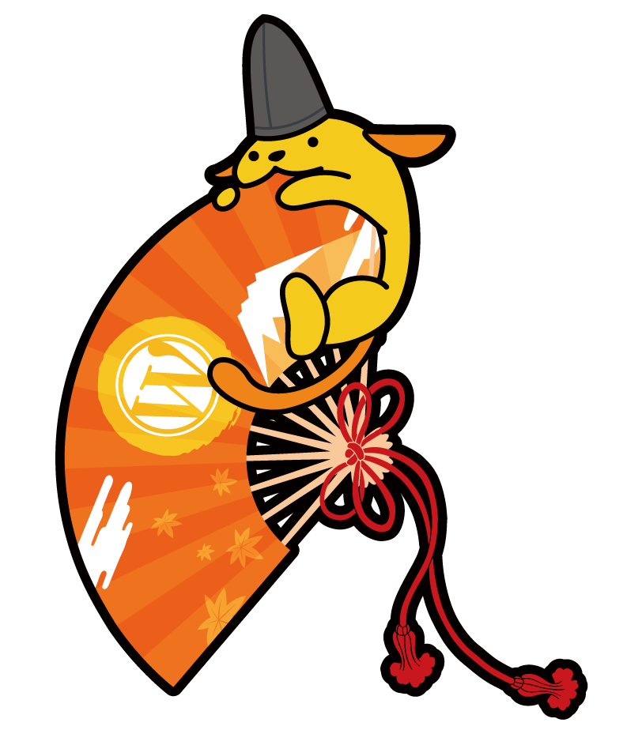

Ougi Wapuu / 扇わぷー
===

## Concept

"Heian" period (One of Japan's history of periodization)

>コンセプトは「平安時代」

>扇わぷーのデザインコンセプトはずばり、「平安時代」です！

>平安時代にはひらがなや和歌など「伝える」ための手段が文化として発達しました。
WordPress も現代における情報伝達の手段ですが、平安時代のように一つの「文化」になったらいいな〜
という思いを込めて立烏帽子と扇、どちらも平安を代表するモチーフを採用しています。

## License
GPLv2 or later

Copyright is owned by Kazuko Kaneuchi, who created the original wapuu charactor.

## WordCamp Tokyo 2016
[https://2016.tokyo.wordcamp.org/](https://2016.tokyo.wordcamp.org/)

---
Designed by [@natsumiine](https://github.com/natsumiine)
